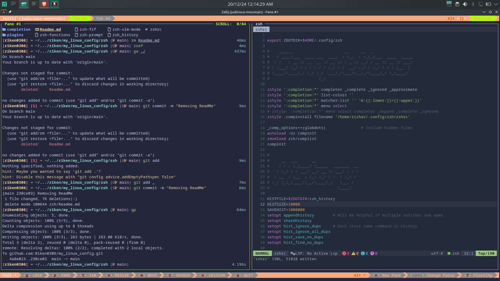

# Linux Configs                                                                                                                                                                                                      

## Programs

### Alacritty
### Kitty
### bash
### zsh
### Vim
### Neovim
### Zellij - The Terminal Multiplexer
### Qt Creator
### VS Code

## Servers

### isc-dhcp & isc-dhcpv6
### dibbler-dhcp-server
### SMB Server (Samba)
### FTP Server
### SSH Server 
### Nginx Web Server
